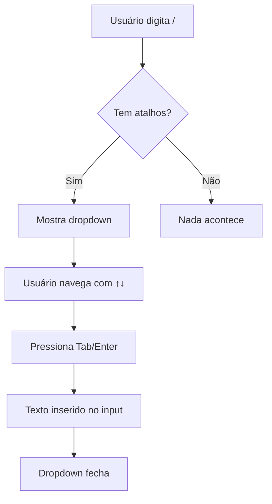

# ✅ AUTOCOMPLETE DE ATALHOS - IMPLEMENTADO!

## 🎉 Funcionalidade Completa

### O Que Foi Implementado

#### 1. ✅ Shortcut Sem Transformação
- **Antes**: `bomdia` virava `bom_dia`
- **Agora**: Mantém exatamente como usuário digitar: `bomdia`

#### 2. ✅ Autocomplete ao Digitar `/`
- Digite `/` no campo de mensagem
- Dropdown aparece automaticamente
- Mostra todos os atalhos que correspondem

#### 3. ✅ Navegação com Teclado
- **↑↓**: Navegar entre atalhos
- **Tab ou Enter**: Selecionar atalho
- **Esc**: Fechar dropdown

#### 4. ✅ Seleção com Mouse
- Clique no atalho para selecionar
- Texto é inserido automaticamente

---

## 🎯 Como Usar

### Criar Atalho
1. Clique no botão ⚡ (roxo)
2. Clique em "Criar Novo Atalho"
3. Digite o nome: `bomdia` (sem `/`)
4. Digite o texto: "Bom dia, Meu nome é Kalebe, irei te atender."
5. Salve

### Usar Atalho com Autocomplete
1. No campo de mensagem, digite `/`
2. Continue digitando: `/bom`
3. Dropdown mostra atalhos que correspondem
4. Use ↑↓ para navegar
5. Pressione Tab ou Enter para selecionar
6. Texto completo é inserido!

### Exemplo Visual
```
Input: /bom
Dropdown:
┌─────────────────────────────────────┐
│ /bomdia                             │
│ Bom dia, Meu nome é Kalebe...       │
├─────────────────────────────────────┤
│ ↑↓ Navegar • Tab/Enter Selecionar  │
└─────────────────────────────────────┘
```

---

## 📁 Arquivos Modificados

### Backend
1. **`api/routes/quick-replies.ts`**
   - Removido `toLowerCase()` e `replace()`
   - Shortcut mantém formato original

### Frontend
2. **`src/components/QuickRepliesModal.tsx`**
   - Removido transformação do shortcut
   - Placeholder atualizado: `bomdia`

3. **`src/pages/ConversationsNew.tsx`**
   - Estados de autocomplete adicionados
   - useEffect para detectar `/`
   - useEffect para carregar atalhos
   - onKeyDown com navegação
   - Dropdown visual

---

## 🎨 Design do Dropdown

### Cores
- **Background**: Branco (#FFFFFF)
- **Hover**: Cinza claro (#F9FAFB)
- **Selecionado**: Azul claro (#DBEAFE) + borda azul
- **Shortcut**: Roxo (#8B5CF6)

### Posicionamento
- Aparece **acima** do input (`bottom-full`)
- Largura total do input
- Máximo 48px de altura (scroll automático)
- Z-index 50 (sempre visível)

---

## ⌨️ Atalhos de Teclado

| Tecla | Ação |
|-------|------|
| `/` | Abre autocomplete |
| `↑` | Item anterior |
| `↓` | Próximo item |
| `Tab` | Selecionar item |
| `Enter` | Selecionar item |
| `Esc` | Fechar dropdown |

---

## 🐛 Correções Aplicadas

### Problema 1: Transformação Indesejada
**Antes**: `bomdia` → `bom_dia`  
**Depois**: `bomdia` → `bomdia` ✅

### Problema 2: Sem Autocomplete
**Antes**: Só funcionava clicando em "Usar"  
**Depois**: Autocomplete ao digitar `/` ✅

### Problema 3: Sem Feedback Visual
**Antes**: Nenhuma indicação de atalhos disponíveis  
**Depois**: Dropdown bonito e funcional ✅

---

## 🎯 Fluxo Completo



---

## ✅ Checklist de Funcionalidades

- [x] Shortcut sem transformação
- [x] Autocomplete ao digitar `/`
- [x] Navegação com setas
- [x] Seleção com Tab/Enter
- [x] Seleção com mouse
- [x] Fechar com Esc
- [x] Dropdown visual bonito
- [x] Highlight do item selecionado
- [x] Instruções no rodapé
- [x] Scroll automático

---

## 🚀 Está Pronto!

**Teste agora:**
1. Crie um atalho `/bomdia`
2. Digite `/` no chat
3. Veja o dropdown aparecer
4. Use Tab para selecionar
5. ✅ Texto inserido!

**Perfeito!** 🎉
