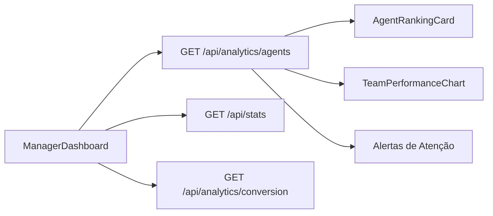
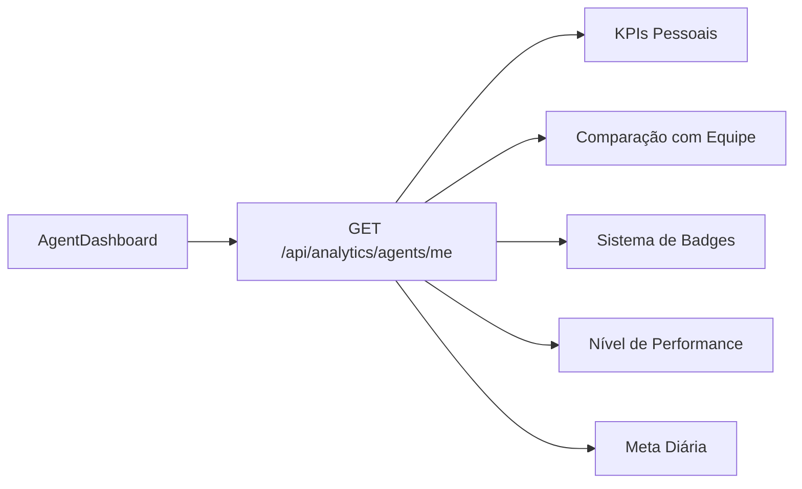

# Dashboards Personalizados por Tipo de Usuário

## Resumo da Implementação

Foi criado um sistema completo de dashboards personalizados que exibe informações diferentes baseadas no tipo de usuário (role), com foco em métricas relevantes para cada perfil.

---

## Arquitetura

### Estrutura de Componentes

```
src/
├── pages/
│   └── DashboardIntelligent.tsx (roteador baseado em role)
├── components/
│   └── dashboards/
│       ├── ManagerDashboard.tsx (MASTER/ADMIN/SUPERVISOR)
│       ├── AgentDashboard.tsx (ATENDENTE)
│       ├── AgentRankingCard.tsx (ranking visual)
│       ├── TeamPerformanceChart.tsx (gráfico comparativo)
│       ├── DailyGoalCard.tsx (metas diárias)
│       ├── TeamComparisonCard.tsx (comparação com equipe)
│       └── PersonalPerformanceChart.tsx (histórico pessoal)
└── utils/
    └── badgeSystem.ts (badges e gamificação)

api/
└── routes/
    └── analytics.ts (novo endpoint /agents/me)
```

---

## Dashboard Gerencial (MASTER/ADMIN/SUPERVISOR)

### Métricas Exibidas

#### KPIs Principais
- **Conversas Ativas**: Total de conversas em atendimento
- **Atendentes Ativos**: Número de atendentes + quantos precisam atenção
- **Tempo Médio da Equipe**: Tempo de resposta médio de todos
- **Conversão da Equipe**: Taxa de conversão média (conversas → agendamentos)

#### Ranking de Atendentes
Mostra os 5 melhores atendentes com:
- Posição (medalhas 🥇🥈🥉)
- Nome do atendente
- Total de conversas
- Tempo médio de resposta
- **Taxa de conversão** (destaque principal)
- Badge de "Top Performer" para o 1º lugar

#### Alertas de Atenção
Seção laranja destacando atendentes que precisam atenção:
- Tempo de resposta > 10 minutos
- Taxa de conversão < 30%

#### Gráficos
1. **Conversão por Atendente**: Gráfico de barras comparativo
2. **Tempo de Resposta por Atendente**: Gráfico de barras (menor = melhor)

#### Métricas Detalhadas
- Total de conversas da equipe
- Performance do bot (conversão automática)
- Identificação do top performer

### API Usada
- `GET /api/analytics/agents?period=7d` - Performance da equipe
- `GET /api/stats?period=24h` - Estatísticas gerais
- `GET /api/analytics/conversion?period=7d` - Métricas do bot

---

## Dashboard Pessoal (ATENDENTE)

### Métricas Exibidas

#### Banner Motivacional
- Nível de performance (Excelente/Ótimo/Bom/Pode Melhorar)
- Mensagem motivacional personalizada
- Posição no ranking (#X de Y atendentes)
- Ícone animado baseado no desempenho

#### Badges Conquistadas
Sistema de gamificação com 6 badges disponíveis:

| Badge | Condição | Ícone |
|-------|----------|-------|
| **Resposta Rápida** | Tempo médio < 3 min | ⚡ |
| **Fechador** | Taxa de fechamento > 80% | 🎯 |
| **Top Performer** | 1º lugar no ranking | 🏆 |
| **Consistente** | Taxa de conversão > 70% | 📈 |
| **Produtivo** | Mais de 15 conversas | 💪 |
| **Conversor** | Mais de 10 agendamentos | 🎁 |

#### Meta Diária
Card visual com:
- Progresso atual / meta (ex: 12 / 15 conversas)
- Barra de progresso animada
- Percentual concluído
- Ícone de check ao atingir meta

#### KPIs Pessoais
- **Minhas Conversas**: Total + quantas ativas agora
- **Taxa de Conversão**: % de conversas que viraram agendamento
- **Tempo de Resposta**: Média pessoal + comparação com equipe
- **Taxa de Fechamento**: % de conversas encerradas

#### Comparação com a Equipe
3 cards mostrando:
- Sua métrica vs média da equipe
- Diferença absoluta e percentual
- Indicador visual (acima/abaixo/na média)
- Ícone de tendência (↑ ↓ ─)

Métricas comparadas:
1. Tempo de Resposta (menor é melhor)
2. Taxa de Conversão (maior é melhor)
3. Taxa de Fechamento (maior é melhor)

#### Dicas de Melhoria
Cards contextuais que aparecem se:
- Tempo de resposta > 5 min → "Responda Mais Rápido"
- Conversão < 50% → "Foque em Agendamentos"
- Fechamento < 70% → "Encerre Conversas"
- Menos de 3 badges → "Desbloqueie Badges"

### API Usada
- `GET /api/analytics/agents/me?period=7d` - Estatísticas pessoais

---

## API: Estatísticas Pessoais

### Novo Endpoint

**`GET /api/analytics/agents/me`**

**Arquivo:** [`api/routes/analytics.ts`](api/routes/analytics.ts)

**Query Params:**
- `period`: '7d' ou '30d' (padrão: '7d')

**Resposta:**

```json
{
  "personal": {
    "totalConversations": 25,
    "closedConversations": 20,
    "withAppointment": 15,
    "conversionRate": 60.0,
    "avgResponseTimeMinutes": 4,
    "closeRate": 80.0,
    "activeNow": 3
  },
  "comparison": {
    "teamAvgResponseTime": 6,
    "teamAvgConversionRate": 55.0,
    "teamAvgCloseRate": 75.0,
    "performanceDelta": -2,
    "isAboveAverage": true
  },
  "rank": {
    "position": 2,
    "total": 8
  }
}
```

**Cálculos:**
- Busca conversas onde `assignedToId = userId`
- Calcula métricas pessoais (conversão, tempo, fechamento)
- Compara com todos os atendentes (role = 'ATENDENTE')
- Calcula ranking por taxa de conversão
- Retorna posição no ranking

---

## Sistema de Badges

### Arquivo: `src/utils/badgeSystem.ts`

#### Interface de Badge

```typescript
interface Badge {
  id: string
  name: string
  description: string
  icon: string
  color: string
  bgColor: string
  borderColor: string
  condition: (stats: AgentStats) => boolean
}
```

#### Badges Disponíveis

1. **Resposta Rápida** (⚡)
   - Condição: `avgResponseTimeMinutes < 3`
   - Cor: Amarelo

2. **Fechador** (🎯)
   - Condição: `closeRate > 80`
   - Cor: Verde

3. **Top Performer** (🏆)
   - Condição: `rank === 1`
   - Cor: Dourado

4. **Consistente** (📈)
   - Condição: `conversionRate > 70`
   - Cor: Azul

5. **Produtivo** (💪)
   - Condição: `totalConversations > 15`
   - Cor: Roxo

6. **Conversor** (🎁)
   - Condição: `withAppointment > 10`
   - Cor: Rosa

#### Níveis de Performance

Sistema de classificação baseado em score (0-100):

| Nível | Score Mínimo | Ícone |
|-------|--------------|-------|
| Excelente | 90+ | 🌟 |
| Ótimo | 75+ | ⭐ |
| Bom | 60+ | 👍 |
| Pode Melhorar | 0+ | 📊 |

**Cálculo do Score:**
- Taxa de conversão: 40% do peso
- Tempo de resposta: 30% do peso
- Taxa de fechamento: 30% do peso

#### Mensagens Motivacionais

Função `getMotivationalMessage()` gera mensagens contextuais:
- Performance excelente → "Excelente trabalho! Você conquistou X badges"
- Melhoria detectada → "Ótimo progresso! Sua taxa subiu X%"
- Conversão alta → "Continue assim! Você está fazendo um ótimo trabalho"
- Tempo bom → "Sua velocidade de resposta está excelente!"
- Fallback → "Continue se esforçando! Cada conversa é uma oportunidade"

---

## Componentes Reutilizáveis

### 1. AgentRankingCard

**Props:**
- `agents`: Array de atendentes com métricas
- `highlightBest`: Destacar o 1º colocado
- `maxDisplay`: Quantos exibir (padrão: 5)

**Visual:**
- Medalhas para top 3 (🥇🥈🥉)
- Card dourado para 1º, prata para 2º, bronze para 3º
- Mostra conversas, tempo médio e taxa de conversão
- Ícone de troféu para o melhor

### 2. TeamPerformanceChart

**Props:**
- `data`: Array de agentes
- `metric`: Qual métrica exibir (ex: 'conversionRate')
- `title`: Título opcional
- `yAxisLabel`: Label do eixo Y

**Visual:**
- Gráfico de barras horizontal
- Cores responsivas
- Tooltip com detalhes
- Limita a 10 atendentes

### 3. DailyGoalCard

**Props:**
- `current`: Valor atual
- `goal`: Meta a atingir
- `metric`: Nome da métrica
- `icon`: Ícone opcional
- `subtitle`: Texto adicional

**Visual:**
- Barra de progresso animada
- Muda de azul → verde ao atingir meta
- Ícone de check quando completo
- Mostra quanto falta para a meta

### 4. TeamComparisonCard

**Props:**
- `myMetric`: Sua métrica
- `teamAverage`: Média da equipe
- `label`: Nome da métrica
- `unit`: Unidade (ex: "min", "%")
- `lowerIsBetter`: Se menor é melhor (tempo)
- `icon`: Ícone opcional

**Visual:**
- Mostra sua métrica em destaque
- Compara com média da equipe
- Indicadores visuais (↑ ↓ ─)
- Cores: verde (bom), laranja (atenção), cinza (igual)
- Mostra diferença absoluta e percentual

### 5. PersonalPerformanceChart

**Props:**
- `data`: Array de pontos de dados
- `metrics`: Array de métricas a plotar
- `title`: Título opcional
- `height`: Altura do gráfico

**Visual:**
- Gráfico de linhas multi-séries
- Cores pré-configuradas por métrica
- Legend automática
- Tooltip com detalhes

---

## Fluxo de Dados

### Dashboard Gerencial



### Dashboard Pessoal



---

## Diferenças Entre os Dashboards

| Aspecto | Dashboard Gerencial | Dashboard Pessoal |
|---------|---------------------|-------------------|
| **Foco** | Visão da equipe | Auto-acompanhamento |
| **Público** | MASTER/ADMIN/SUPERVISOR | ATENDENTE |
| **Métricas** | Agregadas de toda equipe | Pessoais do usuário |
| **Ranking** | Todos os atendentes | Sua posição |
| **Alertas** | Quem precisa de atenção | Como melhorar |
| **Gamificação** | Não | Sim (badges) |
| **Comparação** | Entre atendentes | Você vs equipe |
| **Ações** | Gerenciar equipe | Ver minhas conversas |

---

## Badges e Gamificação

### Sistema de Conquistas

O sistema de badges motiva atendentes através de:
1. **Objetivos Claros**: Cada badge tem condição específica
2. **Feedback Visual**: Cores e ícones atraentes
3. **Progresso Rastreável**: Vê quantas faltam conquistar
4. **Reconhecimento**: Badge de "Top Performer" é especial

### Níveis de Performance

O cálculo de performance usa uma fórmula ponderada:
- **40%** Taxa de conversão (mais importante)
- **30%** Tempo de resposta (normalizado)
- **30%** Taxa de fechamento

Isso garante que o atendente:
- Foque em gerar agendamentos (conversão)
- Responda rápido (experiência do paciente)
- Organize sua fila (encerrando conversas)

### Mensagens Motivacionais

As mensagens são contextuais e mudam baseadas em:
- Nível de performance atual
- Comparação com período anterior
- Badges conquistadas
- Métricas específicas (velocidade, conversão)

---

## Casos de Uso

### Caso 1: Gestor Verificando Equipe

**Persona:** ADMIN revisando performance da semana

**Fluxo:**
1. Acessa dashboard → vê ranking automaticamente
2. Identifica atendente com tempo alto (alerta laranja)
3. Clica em "Ver todos" → vai para /users
4. Conversa com o atendente para entender dificuldades

**Benefício:** Identificação proativa de problemas

### Caso 2: Atendente Acompanhando Metas

**Persona:** ATENDENTE no meio do expediente

**Fluxo:**
1. Acessa dashboard
2. Vê que está em #3 de 8 atendentes
3. Nota que faltam 3 conversas para atingir meta diária
4. Vê que seu tempo de resposta está abaixo da média (verde)
5. Observa que ainda não conquistou badge "Conversor"
6. Se motiva a fechar mais 2 agendamentos para desbloquear

**Benefício:** Motivação e clareza sobre objetivos

### Caso 3: Supervisor Monitorando Qualidade

**Persona:** SUPERVISOR verificando indicadores

**Fluxo:**
1. Acessa dashboard gerencial
2. Vê que conversão da equipe está em 65%
3. Identifica que 2 atendentes estão com conversão < 30%
4. Analisa gráfico de tempo de resposta
5. Agenda treinamento focado em técnicas de venda

**Benefício:** Decisões baseadas em dados

---

## Melhorias Futuras Possíveis

### Dashboards
- [ ] Histórico de evolução (gráfico de linha pessoal)
- [ ] Filtro por unidade (Vieiralves vs São José)
- [ ] Comparação com mês anterior
- [ ] Exportar relatório pessoal em PDF
- [ ] Configuração de metas personalizadas por atendente

### Badges
- [ ] Sistema de níveis para cada badge (bronze, prata, ouro)
- [ ] Badges secretas/surpresa
- [ ] Histórico de badges conquistadas ao longo do tempo
- [ ] Compartilhar conquistas com a equipe
- [ ] Recompensas por badges (ex: destaque no perfil)

### Gamificação
- [ ] Sistema de pontos (XP)
- [ ] Desafios semanais
- [ ] Competições entre atendentes
- [ ] Hall da fama
- [ ] Notificações quando conquistar badge

### Analytics
- [ ] Previsão de performance baseada em histórico
- [ ] Sugestões automáticas de melhoria (IA)
- [ ] Análise de sentimento das conversas
- [ ] Identificação de padrões de sucesso
- [ ] Alertas proativos (ex: "Você está próximo de bater recorde!")

---

## Como Testar

### Testando Dashboard Gerencial

1. Faça login como **MASTER**, **ADMIN** ou **SUPERVISOR**
2. Acesse `/dashboard`
3. Verifique:
   - ✅ KPIs da equipe aparecem
   - ✅ Ranking de atendentes ordenado por conversão
   - ✅ Alertas laranja para atendentes com problemas
   - ✅ Gráficos comparativos funcionam
   - ✅ Botão de atualizar funciona
   - ✅ Seletor de período (7d/30d) atualiza dados

### Testando Dashboard Pessoal

1. Faça login como **ATENDENTE**
2. Acesse `/dashboard`
3. Verifique:
   - ✅ Banner motivacional com nível de performance
   - ✅ Posição no ranking (#X de Y)
   - ✅ Badges conquistadas aparecem
   - ✅ Meta diária com barra de progresso
   - ✅ KPIs pessoais corretos
   - ✅ Comparação com equipe (3 cards)
   - ✅ Dicas contextuais baseadas em performance
   - ✅ Cores mudam baseado em performance (verde/laranja)

### Testando Sistema de Badges

**Para conquistar todas:**
1. Tenha < 3min de tempo médio → ⚡ Resposta Rápida
2. Feche > 80% das conversas → 🎯 Fechador
3. Seja #1 no ranking → 🏆 Top Performer
4. Tenha > 70% de conversão → 📈 Consistente
5. Atenda > 15 conversas → 💪 Produtivo
6. Gere > 10 agendamentos → 🎁 Conversor

---

## Checklist de Validação

### Backend
- [x] Endpoint `/api/analytics/agents/me` criado
- [x] Cálculo de métricas pessoais implementado
- [x] Comparação com média da equipe funciona
- [x] Ranking calculado corretamente
- [x] Conversas ativas retornadas

### Frontend
- [x] DashboardIntelligent verifica role
- [x] ManagerDashboard criado e funcional
- [x] AgentDashboard criado e funcional
- [x] Sistema de badges implementado
- [x] Componentes reutilizáveis criados
- [x] Gamificação integrada
- [x] Real-time via socket funciona

### UX/UI
- [x] Visual diferenciado entre dashboards
- [x] Cores e ícones consistentes
- [x] Feedback visual claro
- [x] Loading states implementados
- [x] Mensagens motivacionais contextuais
- [x] Responsive design

---

## Impacto Esperado

### Para a Empresa
- **↑ Produtividade**: Atendentes focam em métricas claras
- **↑ Qualidade**: Identificação rápida de problemas
- **↓ Turnover**: Gamificação aumenta engajamento
- **↑ Conversão**: Competição saudável melhora resultados

### Para os Gestores
- **Visibilidade Total**: Sabe quem está indo bem/mal
- **Decisões Rápidas**: Dados em tempo real
- **Gestão Proativa**: Alertas automáticos
- **Métricas Objetivas**: Avaliação justa baseada em dados

### Para os Atendentes
- **Motivação**: Sistema de badges e ranking
- **Clareza**: Sabe exatamente onde melhorar
- **Reconhecimento**: Top performers são destacados
- **Autonomia**: Acompanha próprio progresso

---

**Data de Implementação:** 25/01/2026  
**Status:** ✅ Completo e Funcional  
**Arquivos Criados:** 8 novos arquivos  
**Arquivos Modificados:** 2 arquivos
