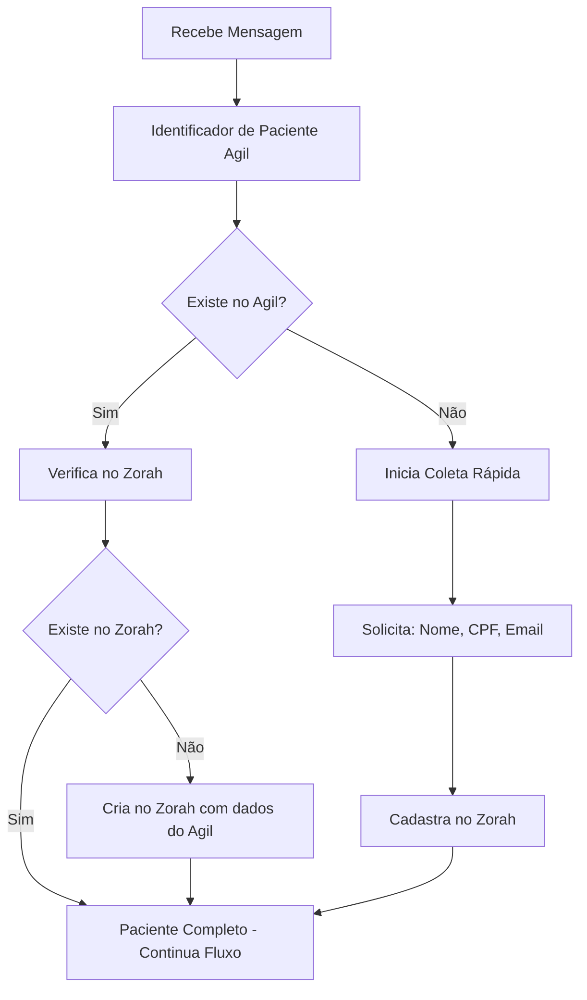

# Sistema de Cadastro Inteligente - N8N + Agil + Zorah

## 📋 Visão Geral

Este documento descreve a integração completa entre:
- **N8N**: Orquestração do fluxo
- **API Agil**: Verificação de cadastro existente no Agil
- **API Zorah**: Cadastro e verificação no sistema Zorah

## 🎯 Objetivo

Criar um fluxo inteligente que:
1. ✅ Verifica se o paciente existe no **Agil** (usando telefone)
2. ✅ Se existe no Agil → Verifica se existe no **Zorah**
3. ✅ Se não existe em nenhum → Coleta dados de forma **rápida e direta**
4. ✅ Cadastra automaticamente no Zorah via API

---

## 🔄 Fluxo Completo



---

## 🛠️ Implementação

### 1. Node: Identificador de Paciente (Agil)

**Já existe no workflow atual** (linha 444-490):

```javascript
{
  "name": "Identificador de Paciente",
  "type": "n8n-nodes-base.httpRequestTool",
  "parameters": {
    "toolDescription": "Use esta tool para identificar o nome do paciente e seus dados cadastrados.",
    "method": "POST",
    "url": "https://app2.clinicaagil.com.br/api/integration/patient_data",
    "sendHeaders": true,
    "headerParameters": {
      "parameters": [
        {
          "name": "X-API-KEY",
          "value": "a5dcc76d202fdc2eb86646c9e57754b19f34fff30332b865b19cca44232b460b-c1a-5468970561"
        },
        {
          "name": "X-API-METHOD",
          "value": "Ch4tB0tW4tsS4v3QRc0d3"
        },
        {
          "name": "accept",
          "value": "application/json"
        },
        {
          "name": "content-type",
          "value": "multipart/form-data"
        }
      ]
    },
    "sendBody": true,
    "contentType": "multipart-form-data",
    "bodyParameters": {
      "parameters": [
        {
          "name": "numero_paciente",
          "value": "={{ $('Extract Data').item.json.phone }}"
        }
      ]
    }
  }
}
```

**Resposta esperada da API Agil:**

```json
{
  "success": true,
  "data": {
    "id": "123456",
    "name": "João Silva",
    "cpf": "12345678900",
    "phone": "5592991234567",
    "email": "joao@example.com",
    "birthDate": "1990-01-15",
    "insuranceCompany": "Unimed",
    "insuranceNumber": "123456789"
  }
}
```

---

### 2. Node: Verificador de Paciente Zorah (NOVO)

**Tool HTTP Request**:

```json
{
  "name": "Verificador Paciente Zorah",
  "type": "n8n-nodes-base.httpRequestTool",
  "parameters": {
    "toolDescription": "Verifica se o paciente já existe no sistema Zorah usando o telefone",
    "method": "GET",
    "url": "=https://zorahapp2-production.up.railway.app/api/patients?search={{ $('Extract Data').item.json.phone }}",
    "options": {
      "response": {
        "response": {
          "neverError": true
        }
      }
    }
  }
}
```

**Resposta esperada:**

```json
{
  "patients": [
    {
      "id": "uuid",
      "name": "João Silva",
      "phone": "5592991234567",
      "cpf": "12345678900",
      "email": "joao@example.com"
    }
  ],
  "pagination": {
    "total": 1
  }
}
```

---

### 3. Node: Switch Cadastro (NOVO)

**Lógica de decisão**:

```javascript
{
  "name": "Switch Cadastro",
  "type": "n8n-nodes-base.code",
  "parameters": {
    "jsCode": `
const agilData = $('Identificador de Paciente').first()?.json?.data || null;
const zorahData = $('Verificador Paciente Zorah').first()?.json?.patients || [];

const existsInAgil = agilData && agilData.name;
const existsInZorah = zorahData.length > 0;

return [{
  json: {
    ...($json),
    registrationStatus: {
      existsInAgil,
      existsInZorah,
      agilData: existsInAgil ? agilData : null,
      zorahData: existsInZorah ? zorahData[0] : null,
      action: existsInAgil && existsInZorah ? 'CONTINUE' :
              existsInAgil && !existsInZorah ? 'CREATE_FROM_AGIL' :
              !existsInAgil && !existsInZorah ? 'COLLECT_DATA' : 'CONTINUE'
    }
  }
}];
`
  }
}
```

---

### 4. Node: Coletor de Dados Rápido (NOVO)

**Agent conversacional para coleta de dados**:

```javascript
{
  "name": "Coletor Rápido Agent",
  "type": "@n8n/n8n-nodes-langchain.agent",
  "parameters": {
    "promptType": "define",
    "text": "={{ $json.chatInput }}",
    "options": {
      "systemMessage": `
Você é Zorah, assistente de cadastro do IAAM.

## MISSÃO:
Coletar dados do paciente de forma RÁPIDA e DIRETA.

## DADOS NECESSÁRIOS:
1. ✅ Nome completo
2. ✅ CPF (validar formato)
3. ✅ Email (opcional, mas recomendado)
4. ✅ Data de nascimento (opcional)

## REGRAS:
- Seja OBJETIVA e RÁPIDA
- Peça TODOS os dados DE UMA VEZ em uma mensagem
- NÃO faça perguntas individuais
- Valide CPF (11 dígitos)
- Confirme os dados antes de salvar

## MENSAGEM INICIAL (use esta):
"Para continuar, preciso de alguns dados rápidos 📋:

1️⃣ Nome completo
2️⃣ CPF
3️⃣ Email (opcional)
4️⃣ Data de nascimento (DD/MM/AAAA) (opcional)

Por favor, envie todos de uma vez, assim:
Nome: João Silva
CPF: 123.456.789-00
Email: joao@email.com
Data: 15/01/1990"

## APÓS COLETAR:
Retorne JSON:
{
  "action": "REGISTER_PATIENT",
  "patientData": {
    "name": "...",
    "cpf": "...",
    "email": "...",
    "birthDate": "..."
  }
}
`
    }
  }
}
```

---

### 5. Node: Criar Paciente no Zorah (NOVO)

**HTTP Request POST**:

```json
{
  "name": "Criar Paciente Zorah",
  "type": "n8n-nodes-base.httpRequest",
  "parameters": {
    "method": "POST",
    "url": "https://zorahapp2-production.up.railway.app/api/patients",
    "authentication": "genericCredentialType",
    "genericAuthType": "httpHeaderAuth",
    "sendHeaders": true,
    "headerParameters": {
      "parameters": [
        {
          "name": "Content-Type",
          "value": "application/json"
        },
        {
          "name": "Authorization",
          "value": "Bearer {{ $env.ZORAH_API_TOKEN }}"
        }
      ]
    },
    "sendBody": true,
    "specifyBody": "json",
    "jsonBody": "={{ {\n  name: $json.registrationStatus?.agilData?.name || $json.patientData?.name,\n  phone: $json.phone,\n  cpf: $json.registrationStatus?.agilData?.cpf || $json.patientData?.cpf,\n  email: $json.registrationStatus?.agilData?.email || $json.patientData?.email,\n  birthDate: $json.registrationStatus?.agilData?.birthDate || $json.patientData?.birthDate,\n  insuranceCompany: $json.registrationStatus?.agilData?.insuranceCompany || null,\n  insuranceNumber: $json.registrationStatus?.agilData?.insuranceNumber || null\n} }}",
    "options": {}
  }
}
```

**Body do request**:

```json
{
  "name": "João Silva",
  "phone": "5592991234567",
  "cpf": "12345678900",
  "email": "joao@example.com",
  "birthDate": "1990-01-15",
  "insuranceCompany": "Unimed",
  "insuranceNumber": "123456789"
}
```

**Resposta esperada (201 Created)**:

```json
{
  "id": "uuid",
  "name": "João Silva",
  "phone": "5592991234567",
  "cpf": "12345678900",
  "email": "joao@example.com",
  "createdAt": "2026-01-25T..."
}
```

---

## 📊 Estrutura Completa do Workflow Atualizado

### Conexões dos Nodes:

```
Webhook Start
  ↓
Extract Data
  ↓
Intent Classifier Agent (com Identificador de Paciente tool)
  ↓
Parse Intent Response
  ↓
[NOVO] Patient Status Checker (Code)
  ├── Verifica resposta do Identificador de Paciente
  └── Verifica se existe no Zorah
  ↓
[NOVO] Registration Router (Switch)
  ├─→ CONTINUE (já cadastrado) → Intent Router
  ├─→ CREATE_FROM_AGIL → Criar Paciente Zorah → Intent Router
  └─→ COLLECT_DATA → Coletor Rápido Agent → Criar Paciente Zorah → Intent Router
```

---

## 🔧 Configuração Necessária

### 1. Variável de Ambiente (Railway/N8N)

```bash
ZORAH_API_TOKEN=seu_token_aqui
```

### 2. Endpoint para buscar paciente por telefone

Já existe em `api/routes/patients.ts`:

```typescript
// GET /api/patients?search=5592991234567
router.get('/', patientsAuth, async (req, res) => {
  const { search } = req.query
  // Busca por phone, name ou cpf (case insensitive)
})
```

### 3. Endpoint para criar paciente

Já existe em `api/routes/patients.ts`:

```typescript
// POST /api/patients
router.post('/', authMiddleware, async (req, res) => {
  // Cria paciente com validação de CPF e telefone
})
```

---

## 🎨 Exemplo de Fluxo Conversacional

### Cenário 1: Paciente existe no Agil e no Zorah

```
Paciente: "Oi, quero agendar"
Bot: "Olá, João Silva! 😊 Para qual unidade você deseja atendimento?"
```

### Cenário 2: Paciente existe no Agil, mas NÃO no Zorah

```
Paciente: "Oi, quero agendar"
Bot: "Olá! Vi que você já é paciente do IAAM 😊 Vou apenas registrar você no nosso sistema..."
Bot: [Cadastra automaticamente com dados do Agil]
Bot: "Pronto, João Silva! Para qual unidade você deseja atendimento?"
```

### Cenário 3: Paciente NÃO existe em nenhum sistema

```
Paciente: "Oi, quero agendar"
Bot: "Olá! Para continuar, preciso de alguns dados rápidos 📋:

1️⃣ Nome completo
2️⃣ CPF
3️⃣ Email (opcional)
4️⃣ Data de nascimento (opcional)

Por favor, envie todos de uma vez!"

Paciente: "Nome: João Silva
CPF: 123.456.789-00
Email: joao@email.com
Data: 15/01/1990"

Bot: "Perfeito, João Silva! ✅ Cadastro realizado com sucesso!"
Bot: "Para qual unidade você deseja atendimento?"
```

---

## 🚀 Vantagens desta Abordagem

✅ **Redução de passos**: De ~10 mensagens para ~2-3 mensagens  
✅ **UX otimizada**: Coleta de dados em uma única interação  
✅ **Integração dupla**: Agil + Zorah sincronizados  
✅ **Automação total**: Cadastro sem intervenção manual  
✅ **Validação robusta**: CPF, telefone, email validados  
✅ **Menos fricção**: Paciente não precisa repetir dados  

---

## 📝 Checklist de Implementação

### Backend (Zorah)
- [x] Endpoint GET /api/patients com busca por telefone
- [x] Endpoint POST /api/patients com validações
- [x] Validação de CPF
- [x] Validação de telefone
- [ ] Token de autenticação para N8N

### N8N
- [x] Node "Identificador de Paciente" (Agil)
- [ ] Node "Verificador Paciente Zorah"
- [ ] Node "Patient Status Checker" (lógica)
- [ ] Node "Registration Router" (switch)
- [ ] Node "Coletor Rápido Agent"
- [ ] Node "Criar Paciente Zorah"
- [ ] Conexões atualizadas

### Testes
- [ ] Teste: Paciente existe em ambos
- [ ] Teste: Paciente só no Agil
- [ ] Teste: Paciente novo (sem cadastro)
- [ ] Teste: CPF inválido
- [ ] Teste: Telefone inválido
- [ ] Teste: Dados incompletos

---

## 🔐 Autenticação

### Opção 1: Token de API (Recomendado)

Criar um token específico para o N8N no sistema Zorah:

```typescript
// api/routes/auth.ts
router.post('/api/auth/create-api-token', async (req, res) => {
  // Gera token JWT permanente para N8N
  const token = jwt.sign({ 
    type: 'n8n_integration',
    permissions: ['create_patient', 'read_patient']
  }, process.env.JWT_SECRET)
  
  res.json({ token })
})
```

### Opção 2: Bypass em desenvolvimento

Já existe no código:

```typescript
const patientsAuth = process.env.NODE_ENV === 'development'
  ? ((req, res, next) => next())
  : authMiddleware
```

---

## 📊 Métricas e Monitoramento

### KPIs a Acompanhar

1. **Taxa de cadastro automático**: Pacientes cadastrados sem intervenção
2. **Tempo médio de cadastro**: Do início ao fim do processo
3. **Taxa de erro**: CPF/telefone inválidos
4. **Taxa de conversão**: De coleta de dados até agendamento
5. **Sincronização Agil↔Zorah**: % de pacientes sincronizados

### Logs Importantes

```javascript
// No node "Criar Paciente Zorah"
console.log('📝 Cadastro:', {
  source: existsInAgil ? 'agil' : 'manual',
  phone: phone,
  timestamp: new Date().toISOString()
})
```

---

**Última atualização**: 25/01/2026  
**Versão do workflow**: 2.2.4 → 2.3.0 (com cadastro inteligente)
